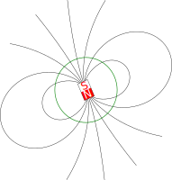

<!--
-------------------------------------------------------------------------------
This file defines the contents of each slide.
The reveal.js configuration can be found in index.html
-------------------------------------------------------------------------------
-->

<!-- .slide: class="slide-title" data-background-opacity="0.3" data-background-image="assets/magali-logo.svg" data-background-color="#000000" data-background-size="contain" -->

<!-- Place the content at the bottom of the slide -->

<h1 id="talk-title">
  
  Magali: Modelling and inversion of magnetic microscopy data 🧲🔬

</h1>

  <a id="talk-speaker">Yago M Castro</a>

<!-- Place location and date side-by-side with affiliation logos -->

<i class="fa fa-calendar-alt" style="margin: 0 10px 0 0"></i>
12 September 2024

Science Day 2024 | IAG

<!-- Permission to reuse and CC-BY license logo -->
<i class="fa fa-camera" style="margin: 0 10px 0 0"></i>
Feel free to screenshot/share/reuse this presentation

<a href="https://creativecommons.org/licenses/by/4.0/"><i class="fab fa-creative-commons"></i><i class="fab fa-creative-commons-by" style="margin: 0 10px 0 2px"></i>CC-BY 4.0 License</a>

<!-- Add logos here. Need these wrappers to align them to the bottom right -->

  
  <!-- 
   -->

===============================================================================

# Paleomagnetism

===============================================================================

  

===============================================================================

  

===============================================================================

  

Souza-Junior (2024)

===============================================================================

  

[Glenn et a. (2017)](https://doi.org/10.1002/2017gc006946)

===============================================================================

<!-- .slide: class="slide-title" data-background-opacity="1" data-background-image="assets/microscope-data.svg"  data-background-size="contain" -->

[Araujo et al. (2019)](https://doi.org/10.3390/s19071636)

===============================================================================

# Needs

- **Open software** for forward **modelling** and **inversion** techniques specific to magnetic microscopy 

- **Data conventions**  

- Algorithms for **automatic detection** of magnetic **grains** and its **magnetic moment** determination

===============================================================================

<!-- .slide: data-background-opacity="1" data-background-image="assets/readme-banner.png"  data-background-size="contain" data-background-color="#262626" -->

===============================================================================

<!-- .slide: data-background-opacity="0.2" data-background-image="assets/magali-logo.png"  data-background-size="contain" data-background-color="#262626" -->

What is Magali?

Free and open source 
 
<i class="fab fa-github"></i> <i class="fas fa-lock-open"></i>  <i class="fab fa-osi"></i>

Python library <i class="fab fa-python"></i>

Modelling and processing magnetic microscopy data 
 
<i class="fas fa-magnet"></i> <i class="fas fa-microscope"></i>

===============================================================================

<!-- .slide: data-background-opacity="0.2" data-background-image="assets/magali-logo.png"  data-background-size="contain" data-background-color="#262626" -->

# Why do we want to make it?

- Provide code that is **easy to use**

- Determine the **spatial positions** of **multiple** grains

- Facilitate the creation of **synthetic data**

- Propose a standard **data format**

- Serve as a **foundation** for new methods 

- Leverage the potential of emerging **magnetic microscopy** studies

===============================================================================

<!-- .slide: data-background-opacity="0.2" data-background-image="assets/magali-logo.png"  data-background-size="contain" data-background-color="#262626" -->

<i class="fas fa-comments"></i>
 
Contact:
<a>yagomcastro1@gmail.com</a>

<i class="fab fa-github"></i>
 
Source code for this presentation:
 
[github.com/YagoMCastro/science-day-2024-magali](https://github.com/leouieda/talk-template)

<i class="fab fa-creative-commons"></i><i class="fab fa-creative-commons-by"></i>
 
Unless otherwise noted,
the contents of this presentation are
licensed under the
 
[Creative Commons Attribution 4.0 International License](https://creativecommons.org/licenses/by/4.0/).

